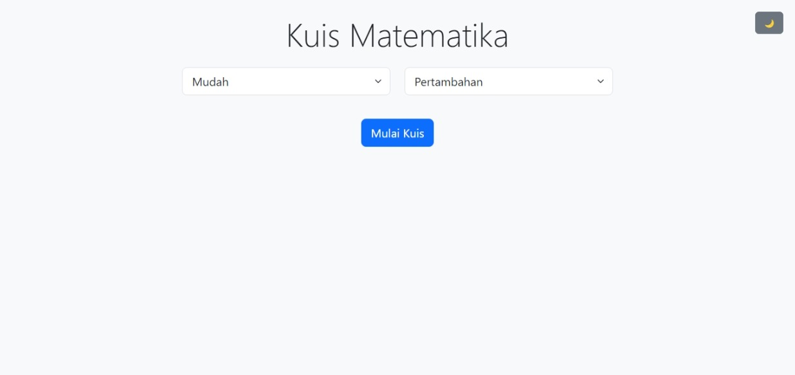

# Kuis Matematika Interaktif

Sebuah aplikasi kuis matematika berbasis web dengan fitur tema gelap/terang, tingkat kesulitan, dan berbagai jenis operasi matematika.

 <!-- Tambahkan screenshot jika ada -->

## Fitur Utama

🎨 **Tema Dinamis**  
- Dukungan tema terang/gelap otomatis  
- Tombol toggle tema interaktif  

📊 **Tingkat Kesulitan**  
- 3 level kesulitan: Mudah, Sedang, Susah  
- Rentang angka yang disesuaikan otomatis  

🔢 **Jenis Operasi Matematika**  
- Pertambahan (+)  
- Pengurangan (-)  
- Perkalian (×)  
- Pembagian (÷)  
- Pangkat (^)  

⏱️ **Sistem Timer**  
- Waktu 30 detik per soal  
- Peringatan visual saat waktu hampir habis  

✅ **Validasi Jawaban**  
- Pengecekan jawaban instan  
- Warna berbeda untuk jawaban benar/salah  

📈 **Hasil Detail**  
- Tabel hasil lengkap dengan jawaban benar dan user  
- Statistik performa  

📱 **Responsif**  
- Desain mobile-friendly  
- Kompatibel dengan berbagai ukuran layar  

## Cara Menggunakan

1. **Pilih Mode**  
   - Pilih tingkat kesulitan dari dropdown  
   - Pilih jenis operasi matematika  
   - Klik "Mulai Kuis"

2. **Jawab Pertanyaan**  
   - Masukkan jawaban di kotak input  
   - Tekan Enter atau klik tombol "Jawab"  
   - Setiap soal memiliki waktu 30 detik

3. **Lihat Hasil**  
   - Hasil lengkap ditampilkan setelah kuis selesai  
   - Klik "Kuis Baru" untuk memulai lagi  

## Teknologi yang Digunakan

- **Bootstrap 5** - Framework CSS untuk desain responsif  
- **Vanilla JavaScript** - Logika aplikasi utama  
- **CSS Variables** - Sistem tema dinamis  
- **HTML5** - Struktur halaman web  

## Instalasi

1. Clone repositori atau download file ZIP
   ```bash
   git clone https://github.com/username/reponame.git
